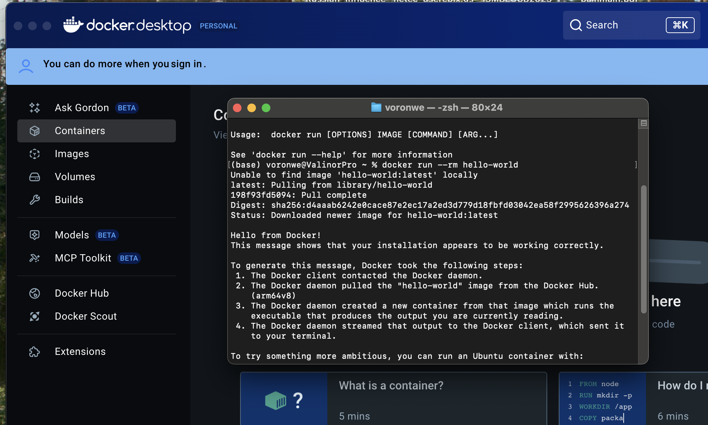

# Konteneryzacja w bioinformatyce (Python)

## 1. Motywacja: problemy reprodukowalności analiz bioinformatycznych

Jednym z kluczowych wyzwań współczesnej bioinformatyki jest **reprodukowalność obliczeń**.  
W praktyce oznacza to możliwość ponownego uruchomienia tej samej analizy:
- przez inną osobę,
- na innym komputerze,
- w innym czasie (np. po kilku miesiącach lub latach),

i uzyskania **tych samych wyników** (lub wyników różniących się wyłącznie losowością jawnie kontrolowaną).

### Typowe źródła problemów z reprodukowalnością

1. **Różnice w wersjach Pythona**
   - np. Python 3.8 vs 3.12
   - zmiany w zachowaniu bibliotek standardowych
   - brak kompatybilności binarnej niektórych pakietów

2. **Różnice w wersjach bibliotek**
   - ta sama komenda `pip install numpy` może zainstalować inną wersję w zależności od czasu
   - zmiany domyślnych algorytmów (np. sortowanie, random seed, backend BLAS)

> **BLAS (Basic Linear Algebra Subprograms)** to standardowy interfejs (API)
> do wykonywania podstawowych operacji algebry liniowej, takich jak:
> - mnożenie macierzy,
> - iloczyny skalarne,
> - operacje na wektorach i macierzach.
>
> BLAS nie jest jednym programem, lecz specyfikacją implementowaną przez
> różne biblioteki (np. OpenBLAS, Intel MKL, Apple Accelerate).
>
>W praktyce ma to duże znaczenie w Pythonie i bioinformatyce, ponieważ wiele popularnych bibliotek:
>- `numpy`,
>- `scipy`,
>- `pandas` (pośrednio),
>- `scikit-learn`,
>
>nie wykonuje obliczeń numerycznych samodzielnie, lecz deleguje je do niskopoziomowych
>bibliotek BLAS/LAPACK dostępnych w systemie.

3. **Zależności systemowe** to biblioteki instalowane na poziomie systemu operacyjnego,
które nie są kontrolowane przez `pip` ani `venv`.

Przykłady:
- **zlib** – biblioteka do kompresji danych (np. obsługa plików `FASTQ.gz`, `VCF.gz`);
- **libcurl** – biblioteka do transferu danych przez sieć (np. pobieranie danych
  referencyjnych, czytanie plików BAM/VCF z adresów HTTP/HTTPS);
- **htslib** – biblioteka do niskopoziomowej obsługi formatów BAM/CRAM/VCF,
  używana przez `samtools`, `bcftools` i `pysam`.

Różnice w wersjach tych bibliotek mogą powodować, że ta sama analiza działa na
jednej maszynie, a na innej już nie.

> **BAM (Binary Alignment/Map [zob](https://en.wikipedia.org/wiki/BAM_(file_format)))** to binarny format pliku służący do zapisu
> **dopasowań odczytów sekwencjonowania (reads)** do genomu referencyjnego.
>
> **CRAM (Compressed Reference-oriented Alignment Map [zob](https://en.wikipedia.org/wiki/CRAM_(file_format)))** to binarny format pliku
> służący do zapisu **dopasowań odczytów sekwencjonowania** do genomu referencyjnego,
> analogiczny do formatu BAM, ale **bardziej wydajny pamięciowo**.
>
> **VCF (Variant Call Format, [zob](https://en.wikipedia.org/wiki/Variant_Call_Format]))** to standardowy format pliku tekstowego służący do
> zapisu **wariantów genetycznych** względem genomu referencyjnego.

4. **Różnice w systemie operacyjnym**
   - Linux vs macOS
   - różne dystrybucje Linuxa (Ubuntu, Debian, CentOS)
   - **różne wersje glibc** – biblioteka standardowa języka C w systemach Linux;
  zmiany jej wersji mogą wpływać na działanie programów binarnych
  (np. narzędzi bioinformatycznych skompilowanych na innym systemie),
  prowadząc do błędów uruchomienia lub subtelnych różnic w zachowaniu.

5. **Brak jednoznacznego opisu środowiska**
   - „uruchomić w Pythonie 3”
   - „zainstalować wymagane pakiety”
   - brak informacji *jak dokładnie* wyglądało środowisko obliczeń

---

### Konsekwencje w praktyce naukowej

- brak możliwości weryfikacji wyników
- problemy z recenzją artykułów
- utrata czasu na „odtwarzanie” środowiska
- niemożność ponownego użycia własnego kodu po dłuższym czasie

W bioinformatyce, gdzie analizy często są:
- wieloetapowe,
- oparte na wielu narzędziach,
- uruchamiane na klastrach HPC,

problem ten jest **szczególnie dotkliwy**.

---

## 2. Kontener jako rozwiązanie

Kontener pozwala zapisać:
- wersję systemu (user-space),
- wersję Pythona,
- wersje bibliotek Python i systemowych,
- sposób uruchamiania aplikacji,

w **jednym, niemutowalnym artefakcie**.

Tym artefaktem jest **obraz kontenera**, który:
- można wersjonować,
- przechowywać w rejestrze,
- jednoznacznie wskazać w dokumentacji lub publikacji.

---

### Kontener vs `venv` — co faktycznie izolujemy?

`venv` izoluje **Pythona**,  
kontener izoluje **środowisko, w którym Python działa**.

#### `venv`
- izoluje **pakiety Python**
- nie izoluje:
  - systemu operacyjnego,
  - bibliotek systemowych,
  - narzędzi binarnych

**`venv` jest wystarczający, gdy:**
- pracujesz lokalnie,
- robisz szybki prototyp,
- nie używasz narzędzi systemowych,
- pracuje jedna osoba,
- kod ma krótki czas życia.

#### Kontener
- izoluje **user-space systemu operacyjnego**
- zawiera:
  - Python,
  - biblioteki Python,
  - binaria systemowe,
  - konfigurację środowiska

**Kontener jest właściwym wyborem, gdy:**
- analiza ma być przekazana innym osobom,
- pipeline ma być uruchamiany na różnych maszynach,
- używasz narzędzi binarnych (np. `samtools`, `bwa`),
- wyniki mają być reprodukowalne w dłuższej perspektywie.

---

### Kontener vs maszyna wirtualna — co faktycznie izolujemy?

Maszyna wirtualna izoluje **cały system operacyjny**,  
kontener izoluje **środowisko użytkownika, współdzieląc kernel**.

___

#### Maszyna wirtualna (VM)

Maszyna wirtualna **emuluje cały komputer**.

VM zawiera:
- własny **kernel systemu operacyjnego**,
- własny **system operacyjny** (Linux, Windows),
- własne biblioteki systemowe,
- własne narzędzia binarne,
- własne środowisko aplikacyjne.

Działa to poprzez **hiperwizor** (np. VirtualBox, VMware, Hyper-V).

Schematycznie:

Sprzęt  
↳ System hosta  
↳ Hiperwizor  
↳ VM  
&nbsp;&nbsp;↳ kernel  
&nbsp;&nbsp;↳ system operacyjny  
&nbsp;&nbsp;↳ aplikacje  

Konsekwencje:
- bardzo silna izolacja,
- duży narzut zasobów (RAM, CPU, dysk),
- długi czas uruchamiania (sekundy–minuty).

---

#### Kontener

Kontener **nie emuluje całego komputera**.

Kontener:
- **nie ma własnego kernela**,
- współdzieli kernel z systemem hosta,
- izoluje tylko **user-space systemu operacyjnego**.

Kontener zawiera:
- własny system plików (user-space),
- własne biblioteki systemowe (`glibc`, `zlib`, `libcurl`),
- własne narzędzia binarne,
- aplikację (np. Python + pakiety).

Schematycznie:

Sprzęt  
↳ Kernel systemu hosta  
↳ Kontener A  
&nbsp;&nbsp;↳ user-space + aplikacja  
↳ Kontener B  
&nbsp;&nbsp;↳ user-space + aplikacja  

Konsekwencje:
- bardzo szybkie uruchamianie (sekundy),
- mały narzut zasobów,
- idealne do pipeline’ów i analizy danych.

---

#### Znaczenie praktyczne (bioinformatyka)

**Maszyny wirtualne**:
- dobra izolacja,
- ciężkie,
- rzadziej używane w pipeline’ach bioinformatycznych.

**Kontenery**:
- standard w analizach bioinformatycznych,
- łatwe do przenoszenia,
- szybkie,
- kompatybilne z workflow managerami (Snakemake, Nextflow).

---

#### Maszyny wirtualne (VM)

    ┌───────────────┐     ┌───────────────┐
    │  Aplikacje    │     │  Aplikacje    │
    │    (VM 1)     │     │    (VM 2)     │
    ├───────────────┤     ├───────────────┤
    │ Biblioteki    │     │ Biblioteki    │
    │ systemowe     │     │ systemowe     │
    ├───────────────┤     ├───────────────┤
    │  Kernel VM    │     │  Kernel VM    │
    └───────────────┘     └───────────────┘
            │                     │
            └───────────┬─────────┘
                        │
                ┌─────────────────────┐
                │     Hiperwizor      │
                ├─────────────────────┤
                │  System hosta (OS)  │
                ├─────────────────────┤
                │        Sprzęt       │
                └─────────────────────┘

#### Kontenery (Docker)

    ┌───────────────┐     ┌───────────────┐
    │  Aplikacje    │     │  Aplikacje    │
    │ (Kontener A)  │     │ (Kontener B)  │
    ├───────────────┤     ├───────────────┤
    │ Biblioteki    │     │ Biblioteki    │
    │  user-space   │     │  user-space   │
    └───────────────┘     └───────────────┘
            │                     │
            └───────────┬─────────┘
                        │
                ┌─────────────────────┐
                │    Docker Engine    │
                │ (runtime + daemon)  │
                ├─────────────────────┤
                │ Kernel systemu hosta│
                ├─────────────────────┤
                │        Sprzęt       │
                └─────────────────────┘

---

Kontenery **współdzielą kernel systemu operacyjnego**, ale **nie omijają systemu**.
Aplikacja uruchomiona w kontenerze **nie komunikuje się bezpośrednio z kernelem** —
zawsze istnieje **warstwa runtime**, która:

- tworzy i konfiguruje izolację (namespace’y, cgroups, sieć, filesystemy),
- przygotowuje system plików kontenera,
- zarządza uruchamianiem i kończeniem procesów,
- pośredniczy w dostępie do zasobów systemowych.

Współczesne kontenery w systemach Linux opierają się na kilku mechanizmach
kernela, które razem tworzą iluzję „oddzielnego systemu”.

> **Namespace’y**
>
>**Namespace’y** odpowiadają za **izolację widoku systemu** dla procesu.
>
>Dzięki namespace’om proces w kontenerze:
>- widzi „swoje” procesy (PID namespace),
>- widzi „swój” system plików (mount namespace),
>- ma „swoją” sieć (network namespace),
>- widzi „swoją” nazwę hosta (UTS namespace).
>
>**Efekt:**
> 
> Proces ma wrażenie, że działa w osobnym systemie.

---

> **cgroups (control groups)**
> 
>**cgroups** odpowiadają za **kontrolę zużycia zasobów**.
>
>Pozwalają ograniczyć:
>- ilość używanej pamięci RAM,
>- czas CPU,
>- liczbę procesów,
>- I/O.
>
> **Efekt:**
> 
> Kontener nie może „zabrać” całych zasobów systemu.

---

> **Sieć**
> 
>Kontenery posiadają **wirtualną warstwę sieciową**.
>
>Typowo:
>- każdy kontener ma własny interfejs sieciowy,
>- kontenery komunikują się przez wirtualne sieci,
>- dostęp do sieci hosta jest kontrolowany przez runtime.
>
> **Efekt:**
> 
> Kontenery są logicznie odseparowane sieciowo, mimo że działają na tej samej maszynie.

---

> **Filesystemy**
> 
>Kontenery korzystają z **odizolowanego systemu plików**.
>
>W praktyce:
>- każdy kontener widzi własne `/`, `/usr`, `/lib`,
>- system plików jest tworzony z warstw obrazu,
>- dostęp do plików hosta wymaga jawnego montowania (bind mount, volume).
>
> **Efekt:**
> 
> Kontener widzi tylko te pliki, które zostały mu udostępnione.
>
> **Podsumowanie**
>
> Namespace’y izolują **co proces widzi**,  
> cgroups kontrolują **ile zasobów może zużyć**,  
> sieć i filesystemy tworzą **spójne, odizolowane środowisko wykonania**.

W przypadku **Dockera** rolę tę pełni **Docker Engine**:
- działa jako usługa (daemon),
- wymaga podwyższonych uprawnień,
- centralnie zarządza wszystkimi kontenerami w systemie.

To dlatego Docker:
- jest bardzo wygodny w środowiskach developerskich,
- ale bywa niedostępny na klastrach HPC ze względów bezpieczeństwa.

---

### Apptainer (dawniej Singularity) — ten sam model, inna architektura

**Apptainer** to silnik kontenerów zaprojektowany z myślą o środowiskach
akademickich i HPC.

Kluczowa różnica względem Dockera:
- Apptainer **nie używa demona działającego jako root**,
- kontener uruchamiany jest **jako zwykły proces użytkownika**,
- nie ma centralnej usługi zarządzającej wszystkimi kontenerami.

Mimo to:
- nadal istnieje **runtime**, który:
  - przygotowuje izolację,
  - mapuje system plików,
  - kontroluje dostęp do kernela,
- aplikacja **nigdy nie komunikuje się bezpośrednio z kernelem**.

Różnica polega więc nie na *czy* istnieje warstwa pośrednia,
ale **jak jest zorganizowana**.

---

### Kolejne podsumowanie:

Kontenery zawsze działają przez warstwę runtime:  
**Docker** realizuje ją przez demona systemowego,  
**Apptainer** — przez proces uruchamiany w kontekście użytkownika.

> I ciekawostka - choć **interfejs Dockera wygląda identycznie**, to jego
> **architektura systemowa** na macOS i Linuxie jest fundamentalnie różna.
> 
> Aplikacja → Docker Engine → Linux kernel → sprzęt
>
> Aplikacja → Docker Engine → Linux VM → macOS kernel → sprzęt

---

### Dlaczego to ważne w bioinformatyce?

- Docker dominuje w:
  - developmentcie,
  - CI/CD,
  - lokalnych pipeline’ach.
- Apptainer dominuje w:
  - środowiskach HPC,
  - analizach produkcyjnych,
  - długoterminowych projektach naukowych.

Oba narzędzia:
- realizują ten sam model kontenerów,
- często korzystają z **tych samych obrazów**,
- różnią się architekturą i modelem bezpieczeństwa.

---

## 3. Podstawowe pojęcia konteneryzacji

- **image (obraz)** – niemutowalny szablon środowiska wykonawczego; zawiera system
  plików, biblioteki systemowe, aplikację oraz jej zależności. Obrazy są wersjonowane
  i mogą być wielokrotnie używane do tworzenia kontenerów.

- **container (kontener)** – uruchomiona instancja obrazu; jest procesem działającym
  w izolowanym środowisku. Kontenery są zazwyczaj krótkotrwałe i mogą być tworzone
  oraz usuwane wielokrotnie z tego samego obrazu.

- **registry** – repozytorium obrazów kontenerów (np. Docker Hub); umożliwia
  przechowywanie, wersjonowanie i pobieranie obrazów, podobnie jak GitHub
  przechowuje kod źródłowy.

- **warstwy obrazu (layers)** – obrazy są budowane z warstw odpowiadających kolejnym
  krokom w `Dockerfile`. Warstwy pozwalają na efektywne cache’owanie, przyspieszają
  budowanie obrazów i zmniejszają ich rozmiar.

- **volume / bind mount** – mechanizmy udostępniania danych z systemu hosta do
  kontenera. Pozwalają oddzielić kod i środowisko (obraz) od danych wejściowych
  i wyników analizy, co jest kluczowe w pracy z dużymi danymi bioinformatycznymi.

---

## 4. Uff: w końcu praktyka

___

### Start: sprawdzenie środowiska
 
Zaczynamy od absolutnego minimum. Uruchomimy gotowy kontener bez pisania kodu, żeby zobaczyć jak działa Docker.

**Polecenie:**

    docker --version

Jeśli widzimy wersję, to klient Dockera działa. Na macOS Docker działa w VM (Docker Desktop), ale dla użytkownika komendy są takie same jak na Linuxie.

___

### Pierwszy kontener: Hello World

**Polecenie:**

    docker run --rm hello-world

- Docker sprawdza, czy obraz `hello-world` jest lokalnie.
- Jeśli nie ma, pobiera go z rejestru (Docker Hub).
- Tworzy kontener na podstawie obrazu i uruchamia domyślną komendę.
- Po zakończeniu kontener znika, bo użyliśmy `--rm`.

**Jedno zdanie do zapamiętania:**  
`docker run` = pobierz (jeśli trzeba) → utwórz kontener → uruchom → zakończ → (opcjonalnie) usuń.

**na MacOs** należy najpierw uruchomić Docker Desktop 

___ 

### Co Docker zrobił „pod spodem”?

**Polecenie: lista obrazów**

    docker images

Obrazy są trwałe (to „szablony”). Kontenery są instancjami, zwykle krótkotrwałymi.

**Polecenie: lista działających kontenerów**

    docker ps

**Polecenie: lista wszystkich kontenerów (także zakończonych)**

    docker ps -a

Jeśli nie widzimy `hello-world`, to dlatego, że `--rm` usunęło kontener po zakończeniu.

___

### Python uruchomiony w kontenerze (bez instalacji lokalnej)

Teraz uruchomimy Pythona w kontenerze. Nawet gdyby Python nie był zainstalowany lokalnie, to i tak zadziała, bo Python pochodzi z obrazu.

**Polecenie: Python jednorazowo (wypisz wersję)**

    docker run --rm python:3.12-slim python -c "import sys; print(sys.version)"

To jest Python uruchomiony *wewnątrz* kontenera `python:3.12-slim`. Wersja Pythona jest kontrolowana przez tag obrazu.

**Polecenie: Python interaktywnie**

    docker run --rm -it python:3.12-slim python

**W interpreterze Pythona pokaż (to też jest kod, ale w bloku przez wcięcie):**

    import sys
    print(sys.executable)
    print(sys.version)

**Wyjście z interpretera:**

    exit()

___

### Zamknięcie demo

Właśnie uruchamialiśmy gotowe obrazy. Następny krok to zapakowanie naszej aplikacji Python do obrazu (Dockerfile), uruchomienie jej jako CLI oraz praca na danych przez bind mount. Na koniec powiemy też, dlaczego na HPC często używa się Apptainera zamiast Dockera.

**(Opcjonalnie) szybkie sprzątanie obrazu `hello-world`:**

    docker rmi hello-world

___

## 5. Praca z danymi wejściowymi (bind mount)
 
**Krok 1: przygotowanie lokalnego pliku wejściowego**

W katalogu roboczym (np. na Desktopie lub w katalogu projektu) utwórz plik tekstowy:

    echo "ACTGACTGACTG" > input.txt

Sprawdź zawartość:

    cat input.txt

`input.txt` istnieje **na hoście**, nie w kontenerze.

---

**Krok 2: uruchom kontener bez mountu (kontrola negatywna)**

Spróbuj odczytać plik w kontenerze **bez** udostępniania go:

    docker run --rm python:3.12-slim cat input.txt

**Oczekiwany efekt:**  
Błąd typu „No such file or directory”.

Kontener ma własny system plików i **nie widzi plików hosta**, dopóki ich jawnie nie udostępnimy.

---

**Krok 3: udostępnienie pliku przez bind mount**

Uruchom kontener z opcją `-v` (bind mount):

    docker run --rm \
      -v "$(pwd):/data" \
      python:3.12-slim \
      cat /data/input.txt

**Wyjaśnienie składni:**
- `$(pwd)` – bieżący katalog na hoście
- `/data` – katalog widziany wewnątrz kontenera
- `-v host:container` – mapowanie katalogów

**Efekt:**  
Zawartość pliku zostaje poprawnie wypisana.

---

**Krok 4: odczyt pliku w aplikacji Python w kontenerze**

Teraz użyjmy Pythona zamiast `cat`.

    docker run --rm \
      -v "$(pwd):/data" \
      python:3.12-slim \
      python -c "print(open('/data/input.txt').read())"

**Komentarz:**  
Python działa w kontenerze, ale dane pochodzą z systemu hosta.

---

**Krok 5: interpretacja (WAŻNE)

- plik `input.txt` **nie znajduje się w obrazie**
- kontener:
  - jest jednorazowy,
  - nie przechowuje danych po zakończeniu działania
- dane wejściowe i wyjściowe są **oddzielone od środowiska**

To jest podstawowy wzorzec pracy z danymi w Dockerze i w pipeline’ach bioinformatycznych.

---

> Podsumowanie (znowu):
>
> Kontener zawiera kod i środowisko,  
> dane są dostarczane z zewnątrz przez mounty.

---

#### Zadanie dodatkowe

Zmodyfikuj polecenie tak, aby:
- Python policzył długość sekwencji w pliku,
- wynik został wypisany na standardowe wyjście.

Podpowiedź:

    len(open('/data/input.txt').read().strip())

___

## 6. konteneryzacja aplikacji Python (CLI + dane przez bind mount)

**Cel ćwiczenia**  
Samodzielnie spakować prostą aplikację Python do obrazu Docker,
zbudować obraz i uruchomić ją na danych wejściowych dostarczonych z hosta przez bind mount.

Założenie: robimy minimalny projekt z CLI (jedna funkcja) i plikiem wejściowym na hoście.  
Wersja jest celowo „lekka”, aby skupić się na Dockerfile i uruchamianiu.

---

**Krok 0: Przygotowanie katalogu roboczego**

Utwórz katalog ćwiczenia i wejdź do niego:

    mkdir -p bioinfo_container_demo
    cd bioinfo_container_demo

Sprawdź, że jesteś tu gdzie myślisz:

    pwd

---

**Krok 1: Przygotuj plik wejściowy na hoście**

Utwórz prosty plik FASTA:

    cat > input.fasta << 'EOF'
    >seq1
    ACTGACTGACTG
    >seq2
    ACTGACTG
    EOF

Sprawdź zawartość:

    cat input.fasta

---

**Krok 2 Przygotuj prostą aplikację Python (CLI)**

Utwórz plik `app.py`, który policzy długości sekwencji w FASTA:

    cat > app.py << 'EOF'
    import argparse

    def fasta_lengths(path: str) -> list[int]:
        lengths = []
        current = []
        with open(path, "r", encoding="utf-8") as f:
            for line in f:
                line = line.strip()
                if not line:
                    continue
                if line.startswith(">"):
                    if current:
                        lengths.append(len("".join(current)))
                        current = []
                else:
                    current.append(line)
            if current:
                lengths.append(len("".join(current)))
        return lengths

    def main() -> None:
        parser = argparse.ArgumentParser(description="Compute sequence lengths from a FASTA file.")
        parser.add_argument("--input", required=True, help="Path to input FASTA file")
        args = parser.parse_args()

        lengths = fasta_lengths(args.input)
        print("n_sequences=", len(lengths))
        print("lengths=", lengths)

    if __name__ == "__main__":
        main()
    EOF

**Szybki test lokalny (opcjonalnie):**

    python3 app.py --input input.fasta

Oczekiwane: wypisze liczbę sekwencji i listę długości.

---

**Krok 3 Napisz Dockerfile**

Utwórz plik `Dockerfile`:

    cat > Dockerfile << 'EOF'
    FROM python:3.12-slim

    WORKDIR /app

    # Kopiujemy tylko kod aplikacji (dane będą montowane z hosta)
    COPY app.py /app/app.py

    # Domyślna komenda uruchamiająca aplikację
    ENTRYPOINT ["python", "/app/app.py"]
    EOF

**Komentarz dydaktyczny:**  
- Aplikacja jest w obrazie (kod + Python).  
- Dane wejściowe nie są w obrazie; przekażemy je przez mount.

---

**Krok 4 Zbuduj obraz kontenera**

Zbuduj obraz i nadaj mu tag:

    docker build -t fasta-len:1.0 .

Sprawdź, że obraz istnieje:

    docker images | grep fasta-len

---

**Krok 5 Uruchom aplikację w kontenerze z danymi wejściowymi (bind mount)**

Uruchom kontener tak, aby katalog bieżący hosta był widoczny w kontenerze jako `/data`:

    docker run --rm \
      -v "$(pwd):/data" \
      fasta-len:1.0 \
      --input /data/input.fasta

**Oczekiwany wynik:**  
Wypisze `n_sequences= 2` oraz listę długości, np. `[12, 8]`.

---

**Najczęstsze błędy i szybka diagnoza**

**(A) Błąd: `No such file or directory` dla `/data/input.fasta`**  
To prawie zawsze oznacza, że montujesz zły katalog. Zrób:

    pwd
    ls

Jeśli `input.fasta` nie jest w tym katalogu, to:
- przejdź do katalogu z plikiem (`cd ...`), albo
- zamontuj właściwą ścieżkę, np.:

    docker run --rm \
      -v "$HOME/Desktop:/data" \
      fasta-len:1.0 \
      --input /data/input.fasta

**(B) Brak outputu**  
Sprawdź, czy aplikacja w ogóle startuje (np. czy nie czeka na input):
- uruchom z parametrem `--help`:

    docker run --rm fasta-len:1.0 --help

**(C) Docker nie działa**  
Na macOS upewnij się, że Docker Desktop jest uruchomiony i działa:

    docker info

---

**Krok 6 ponowna modyfikacja**

Dodaj do programu modyfikację.

i przebuduj obraz do wersji `1.1`:

    docker build -t fasta-len:1.1 .

Uruchom ponownie na tym samym pliku wejściowym.

---

## 7. importy bibliotek 

Poniżej jest proste rozszerzenie poprzedniego ćwiczenia tak, aby nasza aplikacja używała `numpy`.

---

### Część 1 — Zmiana `bioinfo_container_demo` tak, aby używał NumPy

Załóżmy, że jesteś w katalogu projektu (tam gdzie masz `app.py`, `Dockerfile`, `input.fasta`).

**1) Dodaj plik `requirements.txt` (pinning wersji dla reprodukowalności)**

    cd ~/Desktop/bioinfo_container_demo   # dostosuj ścieżkę
    echo "numpy==1.26.4" > requirements.txt

**Komentarz:**  
Pinning (np. `numpy==1.26.4`) sprawia, że build obrazu jest bardziej reprodukowalny.

---

**2) Zmień `app.py`, aby używał NumPy do statystyk**

Zastąp `app.py` poniższą wersją (liczy długości sekwencji z FASTA oraz min/max/mean/std):

    cat > app.py << 'EOF'
    import argparse
    import numpy as np

    def fasta_lengths(path: str) -> np.ndarray:
        lengths = []
        current = []
        with open(path, "r", encoding="utf-8") as f:
            for line in f:
                line = line.strip()
                if not line:
                    continue
                if line.startswith(">"):
                    if current:
                        lengths.append(len("".join(current)))
                        current = []
                else:
                    current.append(line)
            if current:
                lengths.append(len("".join(current)))
        return np.array(lengths, dtype=int)

    def main() -> None:
        parser = argparse.ArgumentParser(description="Compute FASTA length statistics.")
        parser.add_argument("--input", required=True, help="Path to input FASTA file")
        args = parser.parse_args()

        lengths = fasta_lengths(args.input)
        if lengths.size == 0:
            print("No sequences found.")
            return

        print("n_sequences=", int(lengths.size))
        print("min_len=", int(lengths.min()))
        print("max_len=", int(lengths.max()))
        print("mean_len=", float(lengths.mean()))
        print("std_len=", float(lengths.std(ddof=0)))

    if __name__ == "__main__":
        main()
    EOF

**(Opcjonalnie) test lokalny:**

    python3 app.py --input input.fasta

---

**3) Zmień `Dockerfile`, aby instalował zależności z `requirements.txt`**

Zastąp `Dockerfile` wersją poniżej:

    cat > Dockerfile << 'EOF'
    FROM python:3.12-slim

    WORKDIR /app

    # 1) Najpierw requirements -> lepszy cache: zmiany w kodzie nie psują warstwy zależności
    COPY requirements.txt /app/requirements.txt
    RUN pip install --no-cache-dir -r /app/requirements.txt

    # 2) Potem kod
    COPY app.py /app/app.py

    ENTRYPOINT ["python", "/app/app.py"]
    EOF

**Co się zmieniło i dlaczego to ważne (krótko):**
- doszła warstwa instalująca NumPy,
- instalacja zależności jest przed kopiowaniem kodu → Docker może cache’ować tę warstwę,
- `--no-cache-dir` ogranicza „śmieci” w obrazie.

---

**4) Zbuduj nowy obraz**

    docker build -t bioinfo-demo-np:1.2 .

---

**5) Uruchom na danych przez bind mount**

Jeśli `input.fasta` jest w tym katalogu:

    docker run --rm \
      -v "$(pwd):/data" \
      bioinfo-demo-np:1.2 \
      --input /data/input.fasta

---

##  8 Mini-pipeline: 2 kontenery, 2 kroki

Zrobimy pipeline, w którym:
- **Krok A (gotowy kontener bioinformatyczny)**: filtrujemy FASTA — zostawiamy tylko sekwencje o długości ≥ 10,
- **Krok B (nasz kontener z NumPy)**: liczymy statystyki długości na przefiltrowanym FASTA.

W przykładzie używam obrazu `staphb/seqkit` dostępnego na Docker Hub.

---

#### Krok A — Filtr FASTA w kontenerze `seqkit` (Docker Hub)

1) Upewnij się, że masz wejściowy FASTA:

    ls
    cat input.fasta

2) Uruchom `seqkit` w kontenerze i zapisz wynik na hoście jako `filtered.fasta`:

    docker run --rm \ 
        -v "$(pwd):/data" \
        staphb/seqkit:2.12.0 \
        seqkit seq -m 10 /data/input.fasta -o /data/filtered.fasta

**Komentarz:**
- używamy gotowego narzędzia bioinformatycznego (binaria są w obrazie),
- wejście i wyjście są w `/data`, czyli w zamontowanym katalogu hosta,
- plik wynikowy pojawi się obok `input.fasta` jako `filtered.fasta`. :contentReference[oaicite:1]{index=1}

> Tutaj ja dostaję:
> 
> docker: Error response from daemon: no matching manifest for linux/arm64/v8 in the manifest list entries: no match for platform in manifest: not found
>
> warto podpytać AI
> 
> Uruchamiamy obraz x86_64 na ARM przez emulację. To działa, ale jest wolniejsze.
>  

    docker run --rm \
        --platform linux/amd64 \
        -v "$(pwd):/data" \
        staphb/seqkit:2.12.0 \
        seqkit seq -m 10 /data/input.fasta -o /data/filtered.fasta

> Alternatywnie możesz użyć oficjalnego obrazu seqkit, który ma wersje multi-arch. 
> To pochodzi z **BioContainers (bardzo ważny ekosystem w bioinformatyce).**
> 

    docker run --rm \
        -v "$(pwd):/data" \
        quay.io/biocontainers/seqkit:2.8.0--h9ee0642_0 \
        seqkit seq -m 10 /data/input.fasta -o /data/filtered.fasta

3) Sprawdź wynik:

    ls
    cat filtered.fasta

---

#### Krok B — Statystyki na wyniku Krok A (nasz kontener z NumPy)

Uruchom naszą aplikację na `filtered.fasta`:

    docker run --rm \
      -v "$(pwd):/data" \
      bioinfo-demo-np:1.2 \
      --input /data/filtered.fasta

---

### Co to „udaje” jako pipeline (intuicja)

- Każdy krok ma własne środowisko (kontener) i własne narzędzie.
- Dane przepływają między krokami przez **pliki na hoście** (bind mount),
  co jest najprostszym i bardzo typowym modelem w analizach bioinformatycznych.
- Taki układ łatwo potem przenieść do workflow managera (Snakemake/Nextflow),
  gdzie każdy krok ma swój obraz.

---
