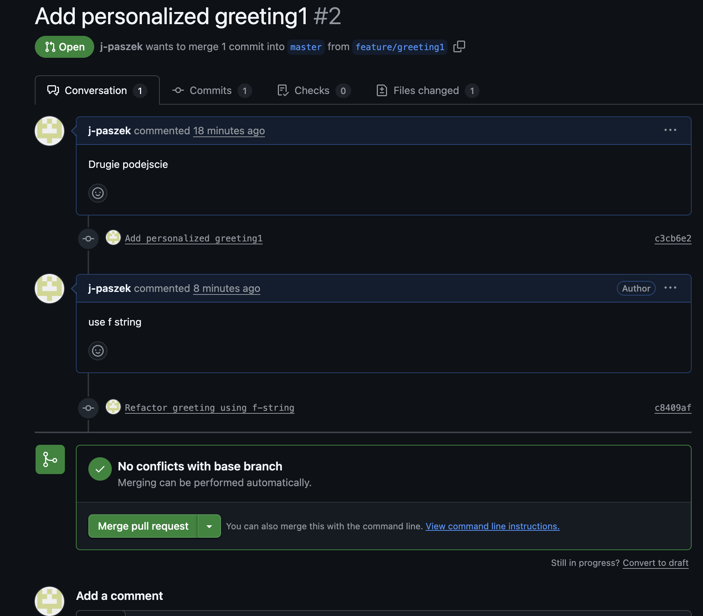
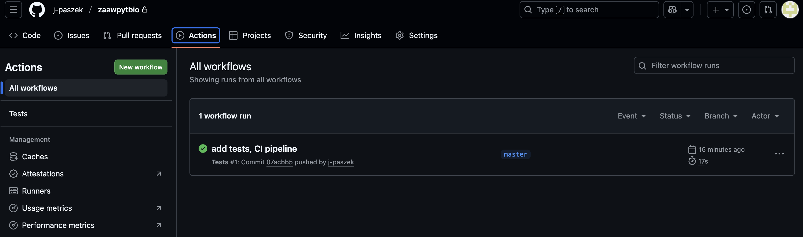
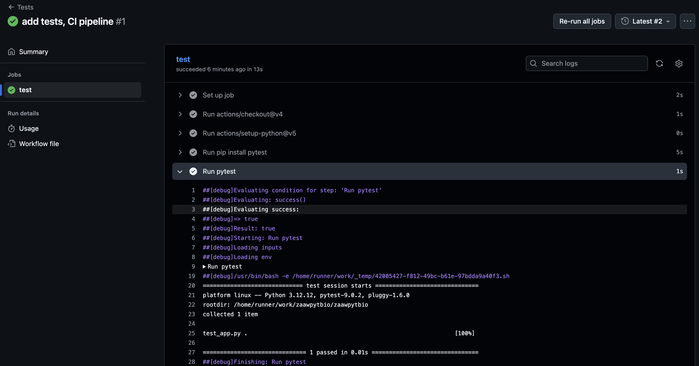

## Git 2: the decisive showdown*

*the decisive showdown^/Judgment Day/reactivation/the chamber of secrets/attack of the clones (pick your favorite film series)

in the future, when discussing AI, this will fit nicely: Git 3: Rise of the Machines

^ In polish `Obcy decydujące starcie` original title is simply `Aliens`

---
Glossary for the following tasks:

- PR => Pull/Merge Request
- UI => user interface

<hr style="height:7px; border:none; background-color:currentColor;">

We will start by simulating regular work in a company, where a senior developer approves the code written by a junior developer.
Similarly, when working with AI, AI can propose project changes as a PR.
In tasks 1 and 2, we alternate between the roles of senior and junior. In task 3, let’s act out these roles in pairs.

### Task 1 (Feature branch + Pull/Merge Request)
Create a new feature on a separate branch, then open a PR/MR to the `main`/`master` branch.
*See the documentation (GitHub: **Pull Requests**, GitLab: **Merge Requests**).*

#### Solution - step by step

1. Repository initialization:

        git init
        echo "print('Hello')" > app.py
        git add app.py
        git commit -m "Initial version"

2. Add a remote repository (review: **I already have a local repository and want to create a remote project**;
**authentication** see notes C.1 and C.2 below):

        On GitHub/GitLab: "New project / New repository". Then add its URL:

        git remote add origin <URL>
        git push -u origin master

3. Create a feature branch:

        git switch -c feature/greeting

4. Edit the code, commit, and push:

        echo "print('Hello, User')" >> app.py
        git add app.py
        git commit -m "Add personalized greeting"
        git push -u origin feature/greeting

5. After refreshing the page, something like *feature/greeting had recent pushes 1 minute ago* will appear -> **Compare & Pull Request**
   click it; then enter the text and click **Create pull request**
   - base: master
   - compare: feature/greeting

6. After review, merge the PR.
   - in the UI: **Merge pull request** (choose "Create merge commit"; this is selected automatically, use the down arrow to expand)
   - locally: `git switch master` and `git pull` to inspect the changes

---

### Task 2 (Updating a PR after review)
Simulate a code review: make fixes to an existing PR without closing it.
*Hint: Every push to the PR branch automatically updates the PR.*

#### Solution

1. (As the senior) Open the PR and add a code comment. For example: "Use an f-string instead of concatenation". Click **Comment**
2. (As the junior) Modify the code in the local repository:

        git switch feature/greeting
        # modify the code
        git commit -am "Refactor greeting using f-string"
        git push

3. The PR updates automatically.
4. A link "Refactor greeting using f-string" will appear; you can click it to inspect the commit

5. After approval -> Merge.

---

### Task 3 (Fork and Pull Request)
Work in pairs. Each person should publicly share any repository from the previous tasks/exercises.
Make a change in a repository you do not own using a fork and a Pull Request.
Then, as the owner, handle the PR.

### Motivation
We will simulate how to collaborate with repositories for which you do not have write permissions.
For example, [biopython](https://github.com/biopython/biopython) has 393 contributors (as of December 8, 2025);
if we wanted to add a feature we implemented ourselves to the project, we would submit a PR.

*Hint: A fork creates your own remote copy of a repository under your account. You have full push access to it,
and you propose changes to the original repository via a Pull Request.*


### Solution - step by step

1. Find the repository you want to contribute to (from the other person in your pair),
for example (with account `OtherAccount` and repository name `genome-analyzer`):

        https://github.com/OtherAccount/genome-analyzer

2. Create a **fork** of the repository on GitHub:

        Fork -> Create a copy under your account

   This creates your repository:

        https://github.com/YourAccount/genome-analyzer

3. Clone your own fork:

        git clone https://github.com/YourAccount/genome-analyzer
        cd genome-analyzer

4. Create a feature branch:

        git switch -c feature/better-export

5. Make changes, commit, and push:

        git add .
        git commit -m "Improve JSON exporter performance"
        git push -u origin feature/better-export

6. Open a Pull Request:

   - base repository: the original project (for example `OtherAccount/genome-analyzer (original)`)
   - compare branch: your branch from the fork (for example `YourAccount:feature/better-export`)

        Create Pull Request

7. Go through code review and fix the code if needed:

        git commit -am "Apply review comments"
        git push

   The PR updates automatically.

8. After approval, the maintainer merges the Pull Request.

---

### Task 3.A (Bonus: updating a fork)
Longer work on a project requires keeping the fork up to date. In the solution described above, let’s add this step:

5.1. The other person in the pair makes a change in their own project (`OtherAccount/genome-analyzer`)

5.2. Update the fork:

        git remote add upstream https://github.com/OtherAccount/genome-analyzer
        git fetch upstream
        git merge upstream/master
        git push

The fork is up to date again.

5.3. We can make further changes as in step 5.

---

#### Summary

A fork is your remote copy of a repository.
It allows:

- full freedom to work,
- safe experimentation,
- participation in open source,
- proposing changes via Pull Request.

This is the basic workflow in large projects, where millions of people do not have access to the main repository.

<hr style="height:7px; border:none; background-color:currentColor;">

A release point is a specific place in the project history stored in a Git repository
that marks a stable version of the program ready to use or distribute. It is usually marked with a tag and serves
as a reference to a verified, completed stage of work.

It is worth reading about version numbering [here](https://semver.org/). In short,
for a version number in the format `MAJOR.MINOR.PATCH`, you should increment:
- **MAJOR** - when you introduce backward-incompatible API changes
- **MINOR** - when you add new functionality in a backward-compatible way
- **PATCH** - when you introduce backward-compatible bug fixes
Additional identifiers for pre-release versions and build metadata are available as
extensions to the `MAJOR.MINOR.PATCH` format.

More about tagging is available [here](https://git-scm.com/book/en/v2/Git-Basics-Tagging),
about releases [here](https://docs.github.com/en/repositories/releasing-projects-on-github/managing-releases-in-a-repository),
and an article on good practices can be found [here](https://pmc.ncbi.nlm.nih.gov/articles/PMC3886731/).

---

Good research data management is based on the FAIR principles: data should be Findable, Accessible, Interoperable,
and Reusable. In other words, it should be easy to find, available, compatible, and ready for reuse. Ensuring
traceability and a persistent reference to research results is crucial, especially in scientific
and software projects.

In this context, many archives have been created, such as Zenodo run by CERN, which enables archiving code,
data, and
documentation while assigning them a DOI (Digital Object Identifier). Thanks to this, resources become easy to cite and remain permanently
available, even when the repository or its structure changes (see
[here](https://www.software.ac.uk/blog/making-code-citable-zenodo-and-github)).

Linking Zenodo with releases in Git makes it possible to create stable, unambiguously marked
project versions. Each release can be automatically archived in Zenodo and assigned a DOI, which
ensures consistency between a specific version of the code, analysis results, and scientific publications.

In practice, this means transparency, reproducibility, and a professional approach to sharing software
and data in line with the FAIR principles.

___

### Task 4 (Creating tags and a Release)
Mark a stable project version with a tag and create a Release.


#### Solution

1. Make sure you have the latest version of `master`:

        git switch master
        git pull

2. Create a tag:

        git tag -a v1.0.0 -m "First stable release"
        git push origin v1.0.0

3. On the main page, on the right side below *About*, there is *Releases*. You will now see the information **1 tags**
   there (you can click and inspect it). Click **Releases -> Create a new Release**.
   - choose tag `v1.0.0`
   - add a description of changes
   - **Publish release**

---

### Task 5 (Hotfix from a released version)
Fix a critical bug without interfering with the project’s new development.

#### Note
Here we assume that we noticed a bug worth fixing in the currently working version.
The hotfix branch starts from a tag, not from `develop`.

#### Solution

A hotfix always starts from the latest released tag, for example `v1.0.0`

        git switch -c hotfix/null-pointer v1.0.0

Fix the bug. Change something in a repository file.

        git commit -am "Fix null pointer in JSON export"

After fixing the bug, merge the hotfix into `master`, because that is where the stable releases are located.

        git switch master
        git merge --no-ff hotfix/null-pointer -m "Merge hotfix for null pointer"
        git tag -a v1.0.1 -m "Hotfix for null pointer"
        git push origin master v1.0.1

And we have our release. On the project page, if we click **Releases** and switch the view at the top of the page
from *Releases* to **Tags**, `v1.0.1` will already be visible.

Separately, a `develop` branch was being developed in our project (for example for the future version `1.1.0`), so it does not contain the hotfix.
And we do not want the next release to reintroduce the same bug. Therefore, we update the existing branches.

        git switch develop
        git merge hotfix/null-pointer
        git push


<hr style="height:7px; border:none; background-color:currentColor;">

Additional information can be found [here](https://gitlab.uw.edu.pl/python-tools/continous-integration).

### Task 6 (CI - running tests)
Configure a CI pipeline that runs tests for every push or PR.

#### Hint
- GitHub Actions -> workflow files in `.github/workflows/*.yml`
- GitLab CI -> `.gitlab-ci.yml`

#### Solution - GitHub Actions

File: `.github/workflows/tests.yml`

        name: Tests
        on: [push, pull_request]
        jobs:
          test:
            runs-on: ubuntu-latest
            steps:
              - uses: actions/checkout@v4
              - uses: actions/setup-python@v5
                with:
                  python-version: "3.12"
              - run: pip install pytest
              - run: pytest

After pushing the commits, GitHub will run the workflow.

#### Solution - step by step

1. Let’s assume that our `app.py` contains this code:
```python
def add(a, b):
    return a + b

if __name__ == "__main__":
    print(add(2, 3))
```

2. Create the test `test_app.py`:
```python
from app import add

def test_add():
    assert add(2, 3) == 5
    assert add(-1, 1) == 0
```

3. Run the test locally (you may first need to run `pip install pytest` in the terminal)
4. Create the `workflows` directory, for example by typing this in the terminal:
```bash
mkdir -p .github/workflows
```
5. Create the file `tests.yaml` with the following content:
```yaml
name: Tests

on: [push, pull_request]

jobs:
  test:
    runs-on: ubuntu-latest
    steps:
      - uses: actions/checkout@v4

      - uses: actions/setup-python@v5
        with:
          python-version: "3.12"

      - run: pip install pytest

      - run: pytest
```
and place it at `.github/workflows/tests.yml`

6. Use:
```bash
git commit -am "add tests, CI pipeline"
git push origin master
```

You can view the results of our actions in the Actions tab.

Click the workflow `add tests, CI pipeline`, click `test`, then click `run pytest`. You can inspect the
pytest logs there.

By clicking in the top right corner, you can run the tests again with `re-run all jobs`.

---

### Task 7 (CI only for PRs to master)
Restrict tests to PRs targeting `master` only.

#### Solution

        on:
          pull_request:
            branches: [ "master" ]

---

### Task 8 (Building release artifacts on tags)
Configure CI so that it builds artifacts (for example packages, archives) **only when**
the pushed commit has a version tag.

#### Hint
- GitHub: `upload-artifact` action
- GitLab: `artifacts` in `.gitlab-ci.yml`
- This is a separate job/trigger for tags

#### Solution - GitHub Actions

Create a new workflow:

File `.github/workflows/release.yml`

        name: Release build
        on:
          push:
            tags:
              - "v*"

        jobs:
          build:
            runs-on: ubuntu-latest
            steps:
              - uses: actions/checkout@v4
              - uses: actions/setup-python@v5
                with:
                  python-version: "3.12"
              - run: |
                  mkdir dist
                  echo "Dummy build for $GITHUB_REF" > dist/README.txt
              - uses: actions/upload-artifact@v4
                with:
                  name: release-dist
                  path: dist/

#### Pushing the workflow

        git add .github/workflows/release.yml
        git commit -m "Add release build workflow"
        git push

#### Creating a release

        git tag -a v1.2.3 -m "Release 1.2.3"
        git push origin v1.2.3

#### Result
- CI runs the job
- the build creates an artifact
- in the Actions UI -> Artifacts -> `release-dist.zip`

<hr style="height:7px; border:none; background-color:currentColor;">

### Task 9 (Finding regressions - `git bisect`)
Identify the commit that broke a working feature.

#### Hint
Bisect uses binary search through the commit history.

#### Solution

        git bisect start
        git bisect bad
        git bisect good <hash_of_the_working_version>
        pytest
        git bisect reset

The result will point to the first bad commit.


<hr style="height:7px; border:none; background-color:currentColor;">

#### Note A &nbsp;&nbsp;&nbsp;&nbsp;&nbsp; **I already have a project and want to add an existing virtual environment.**
a) if I want to manually create a completely new environment in the project directory,
I click the terminal (bottom left side) and type, for example, `python -m venv manually`.
Of course, this step can be done through PyCharm, but we want to use an existing virtual environment
according to our task.
b) PyCharm -> Settings -> ProjectName -> Python Interpreter -> Add Interpreter -> Add local interpreter
Select the *select existing* option and in *Python path* enter (or browse to)
`<path>/manually/bin/python` (Linux, macOS) or `<path>\venv\Scripts\python.exe` (Windows)
c) if we completed step a), we close the terminal in the bottom part of PyCharm;
after reopening it, the beginning of the terminal line should show that we are inside our environment
(`(manually)`).

---

#### Note B &nbsp;&nbsp;&nbsp;&nbsp;&nbsp; **I already have a local project I am working on. I want to start using git.**
See task 1, steps 1 and 2.

---

#### Note C.1 &nbsp;&nbsp;&nbsp;&nbsp;&nbsp;**How to use git in the PyCharm terminal? Authentication problems.**
In task 1, after typing `git push -u origin master` in the PyCharm console, we may get:
```bash
Username for 'https://github.com': I type
Password for 'https://itype@github.com':
remote: Invalid username or token. Password authentication is not supported for Git operations.
```
Go to **GitHub**: **Settings -> Developer settings -> Personal access tokens -> Fine-grained tokens**
Create a new **token**:
- in **only select repositories**, you can define which repositories it applies to
- in **Add permissions**, select **contents**; in the window below, *Contents* and *Metadata* will appear; for *Contents*
set Access to **read and write**
- To complete task 6, we should also add **Workflow**, which will appear set to *read and write*
- Create the token
- **Copy the token** (and keep it somewhere safe)
Then in the terminal:
```bash
Username for 'https://github.com': I type
Password for 'https://itype@github.com': (paste the TOKEN here)
```
---
#### Note C.2 &nbsp;&nbsp;&nbsp;&nbsp;&nbsp;**How to connect PyCharm with GitHub?**
We do not want to copy and paste the token every time. What then?
Recommended method: log in through PyCharm (GUI)
- Open **PyCharm**
- Go to **File -> Settings -> Version Control -> GitHub**
- Click **Add account**
- Choose **Log in with GitHub (OAuth)** (PyCharm will open a browser window for authorization)
- **Done - PyCharm will securely store the access token**

After that, if we perform actions through the GUI, no additional login will be required:
- **GUI -> Git -> Push** works automatically

---

#### Note C.3 &nbsp;&nbsp;&nbsp;&nbsp;&nbsp; Resetting the token.
Run:
```bash
git credential-osxkeychain erase
host=github.com
protocol=https
```
The next action such as `git push origin master` will ask again for username and password (as the password, provide the TOKEN
with corrected permissions).
